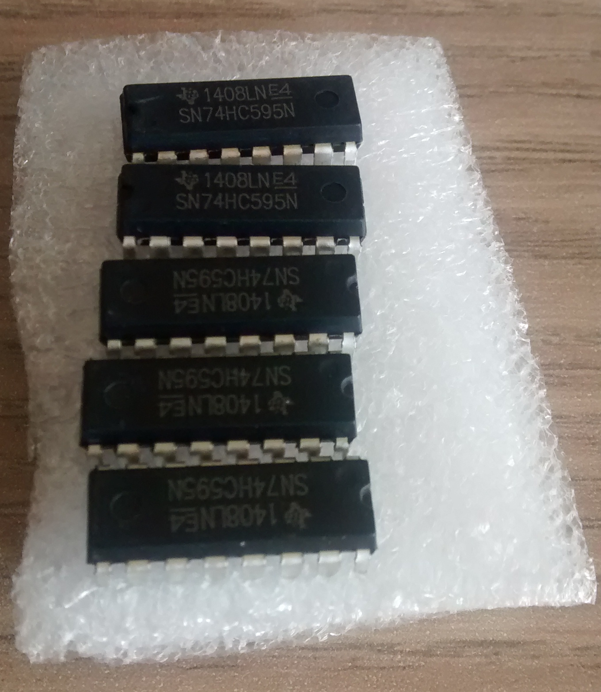

74HC595
=======

Der 74HC595 ist ein Schieberegister, über das mehrere Werte
gleichzeitig ausgegeben werden können, nachdem sie in ein
8Bit-Register geschoben wurden.

Die Werte werden über den Pin `SER` nacheinander in den IC geschoben
und stehen anschließend an der Ausgängen `QA-QH` zur Verfügung. Der
Prozess des Schiebens wird über zwei Clockpins `RCLK`und `SRCLK`
kontrolloiert. Über den Pin `OE` (*output enabled*) wird bestimmt, ob
der Inhalt des Register an den Ausgängen anliegen soll oder nicht.

Die genaue Funktionsweise wird im [Datenblatt](doc/sn74hc595.pdf)
detailiert beschrieben. Weitere Informationen bieten ein 
[Artikel von 
mikrocontroller.net](https://www.mikrocontroller.net/articles/AVR-Tutorial:_Schieberegister) 
und die [Informationen von
sparkfun](https://www.sparkfun.com/products/13699).

Schaltung
---------

Eine einfache Beschaltung lässt eine LED am ersten und letzten
Ausgangspin jeweils blinken. Statt einer LED kann auch ein Multimeter
benutzt werden, um die Spannung an den Ausgangpins zu kontrollieren.
