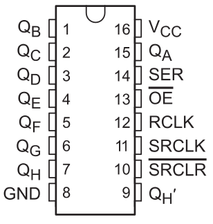

74HC595
=======

Der 74HC595 ist ein Schieberegister, über das mehrere Werte
gleichzeitig ausgegeben werden können, nachdem sie in ein
8Bit-Register geschoben wurden.

Die Werte werden über den Pin `SER` nacheinander in den IC geschoben
und stehen anschließend an der Ausgängen `QA-QH` zur Verfügung. Der
Prozess des Schiebens wird über zwei Clockpins `RCLK`und `SRCLK`
kontrolloiert. Über den Pin `OE` (*output enabled*) wird bestimmt, ob
der Inhalt des Register an den Ausgängen anliegen soll oder nicht.

Die genaue Funktionsweise wird im [Datenblatt](doc/sn74hc595.pdf)
detailiert beschrieben. Weitere Informationen bieten ein 
[Artikel von 
mikrocontroller.net](https://www.mikrocontroller.net/articles/AVR-Tutorial:_Schieberegister) 
und die [Informationen von
sparkfun](https://www.sparkfun.com/products/13699).

Schaltung
---------

Eine einfache Beschaltung lässt eine LED am ersten und letzten
Ausgangspin jeweils blinken. Statt einer LED kann auch ein Multimeter
oder ein weiterer Raspberry Pi genutzt werden, um die Spannung an den
Ausgangpins zu kontrollieren.

Quelltext
---------

Eine Beispielverwendung befindet sich im Quelltext der
Datei [sn74hc595.py](sn74hc595.py).

Demo
----

Ein Demovideo ([mp4](https://archive.org/download/8bit_shift_register/MUTE_20170807_170113.mp4), [ogg Video](https://archive.org/download/8bit_shift_register/MUTE_20170807_170113.ogv) oder 
[Youtube](https://youtu.be/Q4rGgCm2nYc)) zeigt eine Verwendung, bei der eine 1
durch das Register und damit alle Ausgänge geschoben wird.
