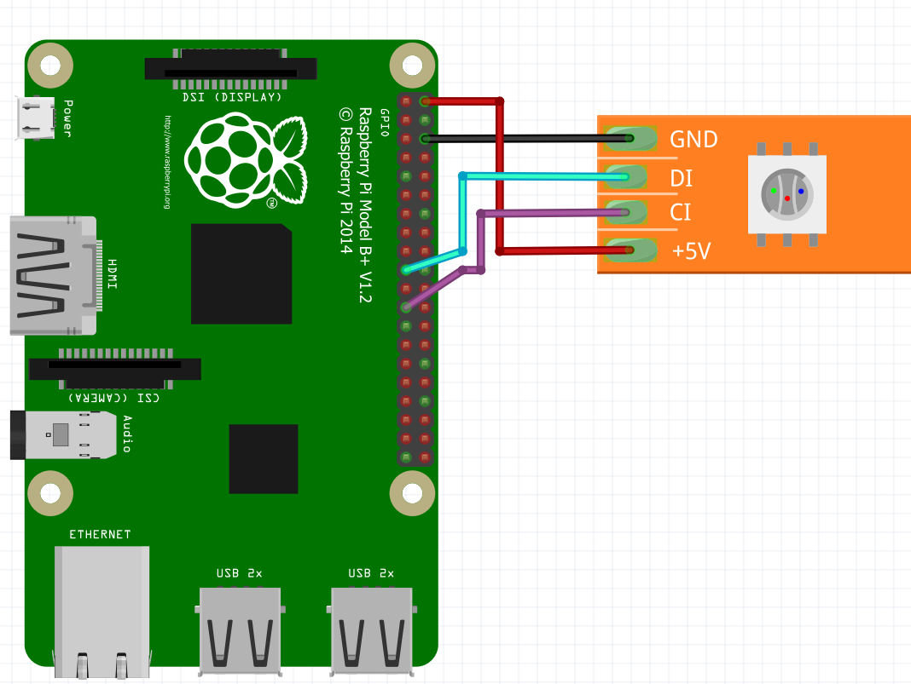

# APA102

Der APA102 ist ein Controller, mit dem RGB-LED auf einem Leuchtstreifen gezielt angesteuert werden können. Er ist ausführlich im [Datenblatt](doc/APA102.pdf) beschrieben. Im Gegensatz zum [WS281x](../ws281x) wird der APA102 Chipsatz über den SPI Bus angesteuert.

## Schaltung

Für eine geringe Anzahl an LEDs liefert der RPi genügend Strom.
Dabei sieht die Schaltung dann wie folgt aus:

Ab ca. 8-10 LEDs wird ein externens Netzteil mit 5V benötigt.

## Zugriff auf SPI aktivieren

Damit der SPI Bus auf dem Raspiberry Pi verwendet werden kann, muss dieser vorher aktiviert werden.
Über das Konfigurationsprogramm `raspi-config` kann dies ganz leicht erledigt werden.

    $ sudo raspi-config

Zuerst in die Interface Optionen:

Danach das SPI Interface auswählen:

Und im letzten Schritt SPI aktivieren:

## Paket Aufbau

Über den SPI Bus wird ein Datenpaket für alle LEDs gesendet.
Das Paket fängt mit 4 Start Bytes an, die 0 sein müssen. Darauf folgt für jede LED die Helligkeit, der rote Farbanteil, der grüne Farbanteil und der blaue Farbanteil.
Zum Schluss folgen 4 End-Bytes.

## Bibliothek

Um die LEDs anzusteuern wird der SPI Bus benötigt. Für die Ansteuerung dessen wird die Bibliothek [spidev](https://pypi.python.org/pypi/spidev) benötigt.

    $ pip3 install spidev

## Quelltext

Mit dem Programm in [apa102.py](apa102.py) leuchten alle LEDs gleichtzeitig in voller Helligkeit in einem Cyanblau auf.
