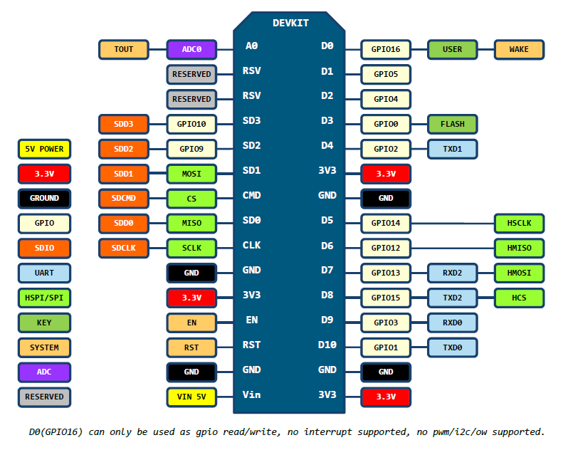

ESP8266
=======

[Micropython](https://micropython.org) ist eine Variante von Python,
die auf verschiedene Mikrocontroller zugeschnitten ist. Der
[ESP8266](http://www.mikrocontroller.net/articles/ESP8266) ist ein
solcher günstiger (~4$) Baustein mit WLAN-Funktionen, für den eine
Micropython-Firmware existiert. Über das nodemcu Development-Kit, das
auf dem Bild zu sehen ist, verfügt der Baustein über einen
USB-Anschluss, über den man mit dem Chip kommunizieren kann. Die PINs
sind herausgeführt und lassen sich in Schaltungen verwenden. 

Die
[Anleitung von Micopython für den ESP8266](http://docs.micropython.org/en/latest/esp8266/index.html)
erklärt viele wesentliche Funktionen. Weitere technische Details 
befinden sich in den folgenden Dokumenten:

- [datasheet](doc/0a-esp8266ex_datasheet_en.pdf)
- [system description](doc/0b-esp8266_system_description_en.pdf)
- [AT instruction set](doc/4a-esp8266_at_instruction_set_en.pdf), [AT command examples](doc/4b-esp8266_at_command_examples_en.pdf)
- [technical reference](doc/esp8266-technical_reference_en.pdf)

## Installation der Firmware

Nun soll die Firmware für Micropython installiert werden. Diese lässt
sich von der Webseite
[herunterladen](https://micropython.org/download/#esp8266).
Für die Installation gibt es das Tool `esptool.py`, das sich ebenso
einfach installieren lässt.

    $ sudo pip install esptool

Anschließend kann die vorhandene Firmware auf den ESP8266 zunächst
gelöscht und mit dem zweiten Befehl die neue Firmware übertragen werden.

    $ esptool.py --port /dev/ttyUSB0 erase_flash
    $ esptool.py --port /dev/ttyUSB0 --baud 115200 write_flash --flash_size=detect 0 esp8266-DATUM-v1.VERSION.bin

Wenn es bei Übetragungsgeschwindigkeiten über 115200 Baud zu Problemen kommt,
muss die Geschwindigkeit reduziert werden. 

Die Befehle sind der [Anleitung von
mircopython](http://docs.micropython.org/en/latest/esp8266/esp8266/tutorial/intro.html#deploying-the-firmware)
entnommen.

## Zugriff über die serielle Schnittstelle

Nun kann mit einem Terminalprogramm auf den Microcontroller
zugegriffen werden. Das geht mit `putty, minicom, screen` oder auch
`miniterm.py`, wenn das Board über einen USB-Anschluss
verfügt. Ansonsten fungieren die Pins GPIO1=TX und GPIO3=RX als
serielle Schnittstelle. Die Baudrate beträgt 115200.

    $ screen /dev/ttyUSB0 115200

oder

    $ miniterm.py /dev/ttyUSB0 115200

Für `/dev/ttyUSB0` muss die serielle Schnittstelle angegeben werden,
mit welcher sich der Chip am USB-Port anmeldet. Unter Windows findet man
die Information im Geräte-Manager: `COM` gefolgt von einer Zahl.

Wenn `miniterm.py` noch nicht installiert ist, kann es mit `pip
install pyserial` installiert werden.

Im Anschluss erhält man eine Python-Konsole, die man für eigene Projekte
verwenden kann. Beim Start steht der ESP als Access Point zur Verfügung,
auf den sich Clients mit dem Standardpasswort `micropythoN` verbinden
können.

## Pin-Belegung

Für das [nodemcu-devkit](https://github.com/nodemcu/nodemcu-devkit-v1.0)
existiert eine gute Dokumentation der Pinbelegung. Die Nummerierung
bezieht sich jeweils immer auf die Pinnummer am Chip und kann bei
unterschiedlichen Ausführungen von der Nummerierung auf dem jeweiligen
Board abweichen.

## Dateitransfer

Mit dem mächtigen Tool [ampy](https://github.com/adafruit/ampy) lassen
sich leicht Dateien auf den Chip kopieren, von ihm lesen oder auf ihm
ausführen. Es wird mit `pip3 install adafruit-ampy` installiert. Dazu
muss ggf. eine bestehende Verbindung über die serielle Schnittstelle
zuvor beendet werden.

Dateien lassen sich mit `ls` anzeigen. Der Parameter `-p` gibt die
serielle Schnittstelle an, über die die Verbindung besteht.

    $ ampy -p /dev/ttyUSB0 ls

Dateien können mit `get` lokal ausgegeben werden.

    $ ampy -p /dev/ttyUSB0 get main.py

Sie können auch abgespeichert werden.

    $ ampy -p /dev/ttyUSB0 get main.py main.py

Ebenso einfach können Dateien auf den Chip kopiert werden.

    $ ampy -p /dev/ttyUSB0 put main.py

Eine Datei kann auch direkt ausgeführt werden.

    $ ampy -p /dev/ttyUSB0 run mein_script.py

Neben ampy gibt es weitere Tools für den Dateitransfer.
[mpfshell](https://github.com/wendlers/mpfshell) ist ein
shell-basierter Datei-Explorer, um den ESP zu erkunden.
[rshell](https://github.com/dhylands/rshell) ist eine remote
shell für den ESP8266. 
[webrepl_cli.py](https://github.com/micropython/webrepl) ist 
eine weitere Möglichkeit.

## Ansteuerung über I²C

Der ESP kann über den I²C-Bus auch mit Sensoren oder anderen Modulen
kommunizieren. Zwei der GPIO-Pins werden dafür benötigt: einer als
Clock- (scl) und einer als Daten-Pin (sda).
Die Datei [esp8266_i2c_scan.py](esp8266_i2c_scan.py) zeigt beispielhaft,
wie man auf dem I²C-Bus nach Geräten scannen kann.

## Links

- Vortrag der Froscon 2016: [Python für das Internet der Dinge -
Einführung in MicroPython für ESP8266 und Cortex-M4
Mikroprozessorboards](https://media.ccc.de/v/froscon2016-1791-python_fur_das_internet_der_dinge)
- Unter Windows werden eventuell Treiber für den USB-UART-Konverter benötigt.
  Ein populärer Treiber ist unter 
  [MSXFAQ](http://www.msxfaq.de/sonst/bastelbude/nodemcu.htm) verlinkt.
- [Forum für den 
  Informationsaustausch](http://forum.micropython.org/viewforum.php?f=16) 
  mit Gleichgesinnten.
- [Tutorialreihe mit Videos von Tony DiCola](https://learn.adafruit.com/category/micropython) 
  von Adafruit, die den ESP8266 und die Ansteuerung über MicroPython 
  ausführlich darstellt.

