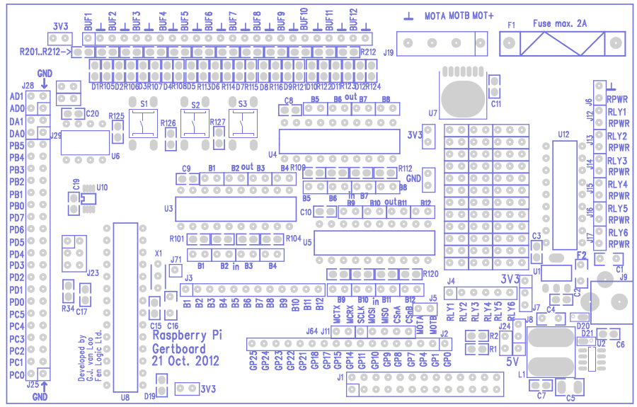
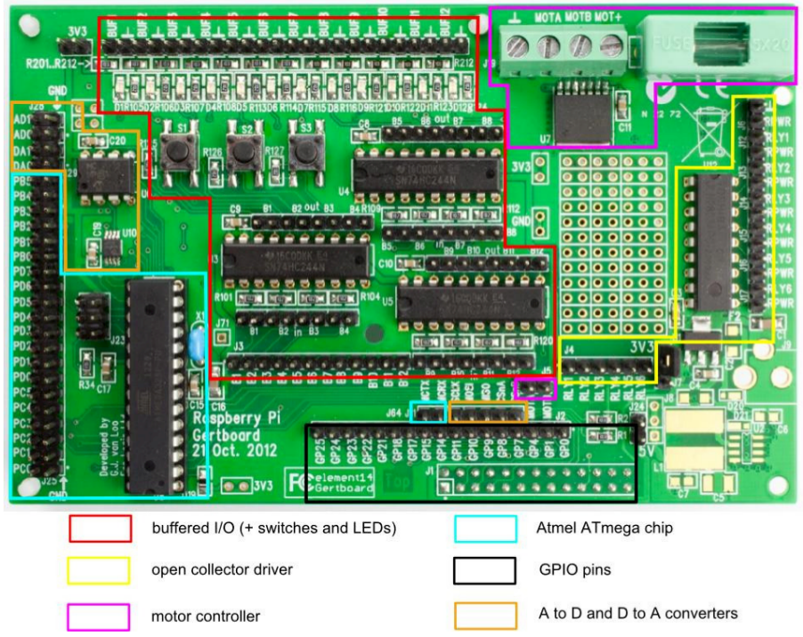
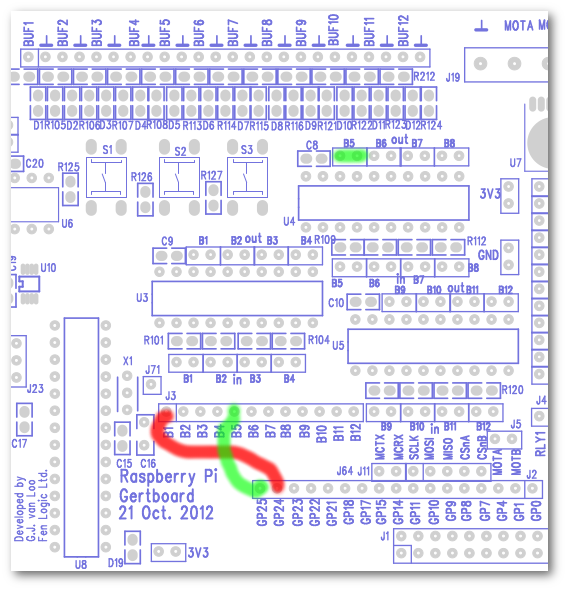

Gertboard
=========

Das Gertboard ist ein vielfältiges Erweiterungsboard für den Raspberry
Pi. Es vereint verschiedene Komponenten auf einer Platine. Eine
ausführliche Beschreibung befindet sich in dem
[Handbuch](doc/Gertboard_UM_with_python.pdf)
([deutsche Übersetzung](doc/Gertboard-Handbuch_deutsch.pdf)).
Die darin referenzierten Programme befinden sich in dem Archiv
[gertboard_py.zip](doc/gertboard_py.zip).

Funktionsblöcke
---------------

Die verschiedene Bestandteile des Gertboard sind im oberen Bild
farblich hervorgehoben.

* 12 gebufferte I/O Ports
* 3 Taster
* 6 open collector Treiber (50V, 0.5A)
* 1 Motortreiber (18V, 2A)
* 1 ATmega microcontroller (28-pin dual in line)
* 1 Digital-Analog Konverter (2 Kanäle: 8, 10, or 12 bit)
* 1 Analog-Digital Konverter (2 Kanäle: 10 bit)

LEDs und Buttons
----------------

Das Gertboard verfügt im oberen Bereich über zahlreiche LED und drei
Taster. Das Programm [gertboard-led_btn.py](gertboard-led_btn.py)
zeigt die Verwendung der Komponenten. Beim Drücken des Tasters wird
eine LED an und wieder ausgeschaltet.

Die beiden folgenden Bilder zeigen eine Verkabeling mit zwei
Steckbrücken und einem Jumper.

Hierfür werden die GPIO im unteren Bereich mit einem der Ports B1-B12
verbunden. Diese wiederum steuern die LED und Button an der oberen
Kante. Die Ports B1-B3 bedienen jeweils die Buttons.

Jeder der Ports ist wie folgt aufgebaut. Der hervorgehobene Bereich
ist nur bei den Taster-Ports B1-B3 vefügbar.

Der Jumper B5 (out) wurde gesetzt, um den Port B5 als Ausgang zu
deklarieren.
