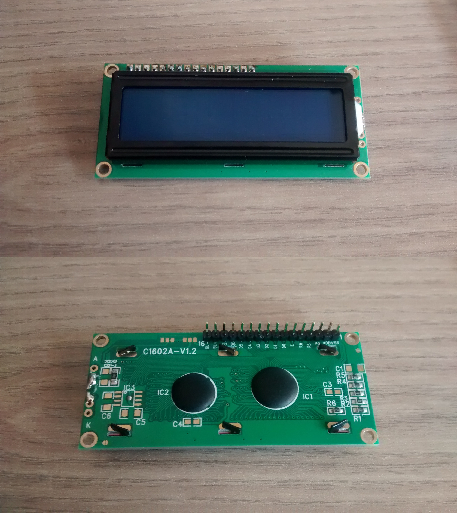
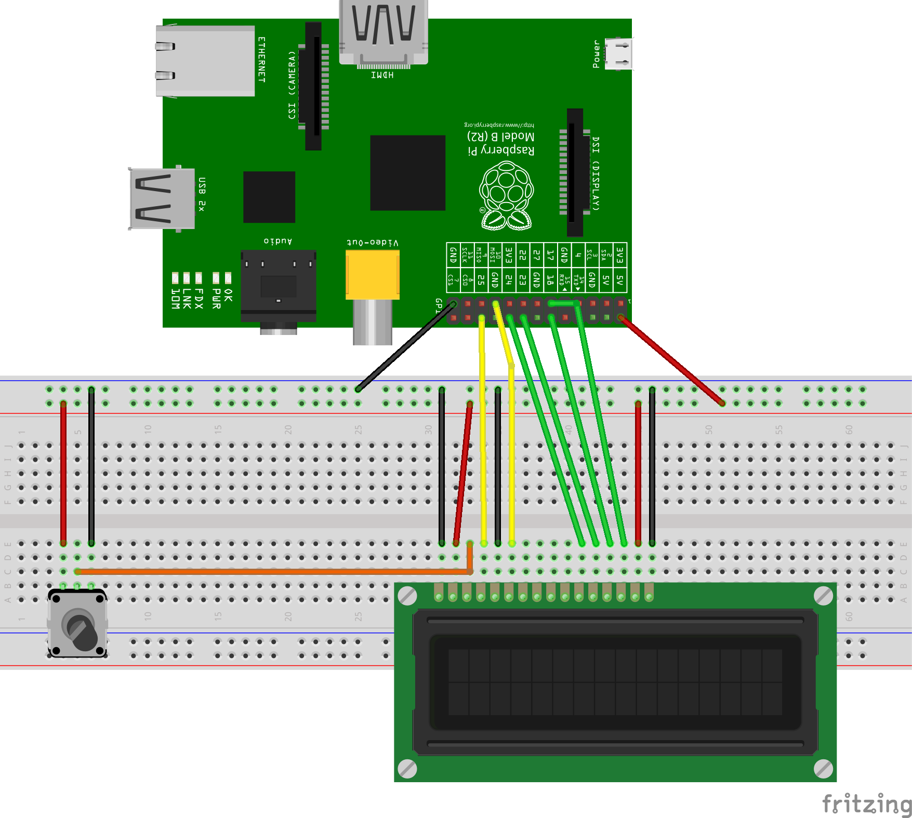
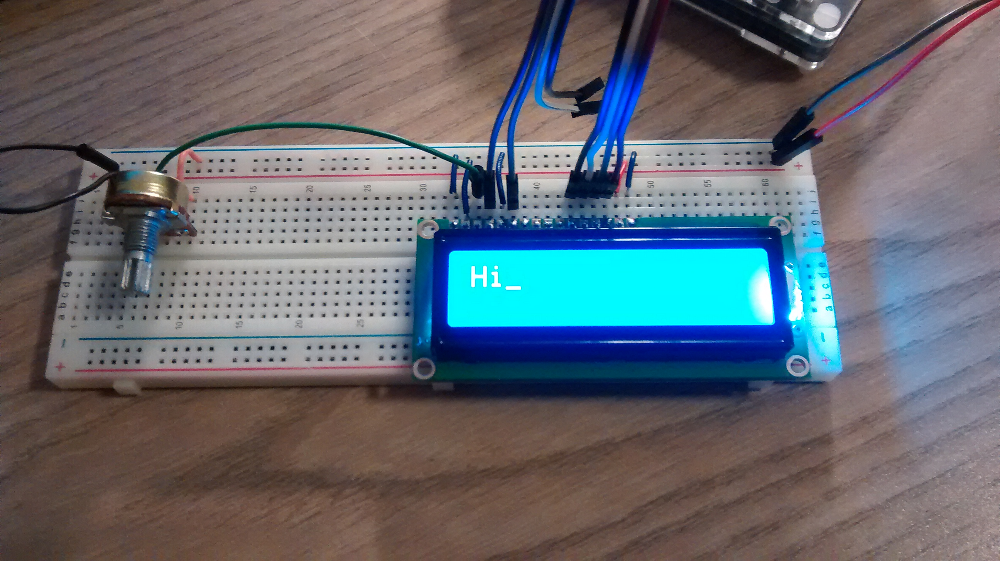

LCD-Treiber HD44780 
===================

Das C1602A ([Datenblatt](doc/C1602a.pdf)) ist ein Board, das ein
LC-Display und einen zugehörigen Treiber auf einer Platine vereint. Das
Display wird mit dem Treiber 
[HD44780](http://www.mikrocontroller.net/articles/HD44780)
angesteuert und in dem
[Datenblatt](doc/HD44780.pdf) beschrieben.

Neben der Beschreibung auf dieser Seite und einer Erklärung
bei [Wikipedia](https://de.wikipedia.org/wiki/HD44780), erläutert eine
[Anleitung von Adafruit](doc/drive-a-16x2-lcd-directly-with-a-raspberry-pi.pdf) die Verwendung des Displays.

Funktionsweise
--------------

Das Display besitzt 16 (manchmal auch nur 14) Pins, über die es
angesteuert werden kann. 

- Pin 1 Vss: Versorgungsspannung 0 Volt
- Pin 2 Vcc: Versorgungsspannung + 5 Volt
- Pin 3 V0: Kontrastspannung, zwischen VEE und VCC, kann auf VSS
  gelegt oder via Poti angeschlossen werden. 
- Pin 4 RS: Registerauswahl (0 = Befehlsregister, 1 = Datenregister)
- Pin 5 R/W: Lese- oder Schreibzugriff; kann fest auf GND gelegt
  werden, wenn Busy-Auswertung durch Timing ersetzt wird (0 =
  Schreiben, 1 = Lesen)
- Pin 6 E: Taktleitung (Achtung! Diese Leitung hat im Gegensatz zu den
  anderen bei einigen Displays keinen internen Pullup, man muss also
  einen externen vorsehen, falls man mit Open-Drain-Ausgängen
  arbeitet.)
- Pin 7 DB0: Datenleitung (bleibt im 4-Bit-Modus offen)
- Pin 8 DB1: Datenleitung (bleibt im 4-Bit-Modus offen)
- Pin 9 DB2: Datenleitung (bleibt im 4-Bit-Modus offen)
- Pin 10 DB3: Datenleitung (bleibt im 4-Bit-Modus offen)
- Pin 11 DB4: Datenleitung
- Pin 12 DB5: Datenleitung
- Pin 13 DB6: Datenleitung
- Pin 14 DB7: Datenleitung
- Pin 15 A: Anode der LED-Hintergrundbeleuchtung
- Pin 16 K: Kathode der LED-Hintergrundbeleuchtung

Der RS-Pin bestimmt, ob ein Befehl oder Daten über die Pins DB0-7
gesendet wird. Die verschiedenen Befehle werden im Abschnitt *Instructions*
im Datenblatt beschrieben. 

Pin E liefert ein Taktsignal. Bei steigender Flanke werden die Signale
auf den Pins DB0-7 als Befehl (RS=0) oder Daten (RS=1) interpretiert.

Zeichen für die Darstellung werden aus einem Character Generator ROM/RAM 
gelesen. Das RAM kann auch mit eigenen Zeichen beschrieben werden. Die
vorhandenen Zeichen befinden sich ebenfalls im Datenblatt.

Schaltung
---------

Das Display wird mit 5V betrieben. Da der Pi nur 3,3 V an seinen
Eingangspins verträgt, darf das Display nur beschrieben, nicht jedoch
ausgelesen werden. Daher ist Pin 5 (R/W) mit GND (0=Schreiben)
verbunden, um ein Lesen zu verhindern.

Quelltext
---------

Eine einfache Anzeige wird im Quelltext der Datei [lcd.py](lcd.py) realisiert.
Nachdem das Display initialisiert wurde, werden zwei Buchstaben an das Display
gesendet.

Funktionsprüfung
----------------

Ein Video 
([mp4](https://archive.org/download/lcd_display_demo/MUTE_20170809_220636.mp4),
[ogg](https://archive.org/download/lcd_display_demo/MUTE_20170809_220636.ogv),
[YouTube](https://www.youtube-nocookie.com/embed/W6sKhcwKmA4?rel=0)) 
zeigt die Funktionsweise des Displays.

