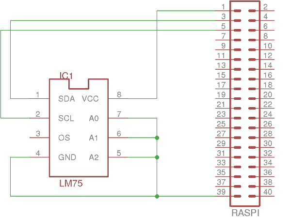

# lm75 Temperatursensor

## Beschreibung

Der LM75 ist ein Temperatursensor, der sich über die I²C-Schnittstelle auslesen
lässt. Hierfür wird der Raspberry Pi (Master) mit Pin 5 und 3 mit SCL bzw. SDA
verbunden. Der I²C-Overlay kann mit raspi-config aktiviert werden.

## Beschaltung

- SDA: Serial Data (I²C)
- SCL: Serial Clock (I²C)
- GND: Masse
- A0, A1, A2: Beeinflusst die Slaveadresse des Sensors.
- VCC: Spannungsversorgung des Sensors (3,3 V)

Auf Pulldown-Widerstände an den Busleitungen kann (und sollte) verzichtet werden, da diese bereits am Raspberry Pi vorhanden sind.

## Adressierung

Die ersten 4 Bit der Slaveadresse sind beim LM75 unveränderbar `0b1001`. Über die Pins A0, A1 und A3 können die letzten (niederwertigen) 3 Bit eingestellt werden. Mit der Betriesspannung (VCC bzw. 3,3 V) an einem Pin wird eine `1` an der entsprechenden Stelle gesetzt. Um eine `0` zu setzen, wird der entsprechende Pin auf Masse (GND) gelegt.

Mit `i2cdetect` kann die Adresse ermittelt werden.

    $ i2cdetect -y 1
         0  1  2  3  4  5  6  7  8  9  a  b  c  d  e  f
    00:          -- -- -- -- -- -- -- -- -- -- -- -- -- 
    10: -- -- -- -- -- -- -- -- -- -- -- -- -- -- -- -- 
    20: -- -- -- -- -- -- -- -- -- -- -- -- -- -- -- -- 
    30: -- -- -- -- -- -- -- -- -- -- -- -- -- -- -- -- 
    40: -- -- -- -- -- -- -- -- 48 -- -- -- -- -- -- -- 
    50: -- -- -- -- -- -- -- -- -- -- -- -- -- -- -- -- 
    60: -- -- -- -- -- -- -- -- -- -- -- -- -- -- -- -- 
    70: -- -- -- -- -- -- -- --         

Der Sensor meldet sich bei diesem Beispiel unter der Adresse
`0x48`.

## Sensor auslesen

Ein einzelner Wert kann mit i2cget aus dem Register `0x00` (dort
liegen die aktuellen Temperaturen) ausgelesen werden. Die Option `w`
liest ein Wort (2 Bytes) aus.

    $ i2cget -y 1 0x48 0x00 w
    0x8018

Dieser Wert muss nun in eine Temperatur umgewandelt werden. Hierzu
werden die ersten beiden Bytes getauscht, die letzten 5 Bits
herausgeschoben und das Ergebnis mit 0.125 multipliziert. Wir testen
dies mal für den obigen Wert.

    >>> 0x8018         # Die ersten Bytes tauschen
    32792
    >>> 0x1880
    6272
    >>> 0x1880 >> 5    # 5 Bits nach rechts raus schieben
    196
    >>> 196 * 0.125    # und mit 0.125 multiplizieren.
    24.5
    >>> (0x1880 >> 5) * 0.125 # Alles in einem Schritt
    24.5
    

Es ergeben sich 24,5 °C. Im Datenblatt wird der Prozess wie folgt
beschrieben.

## Zweierkomplement

Im Temperaturregister wird der Temperaturwert im [Zweierkomplement](https://de.wikipedia.org/wiki/Zweierkomplement) hinterlegt. Wenn die gemessene Temperatur auch negative Werte annehmen kann, müssen weitere Berechnungen mit dem Inhalt des Registers durchgeführt werden. Im [Beispielprogramm des MPU6050](../mpu6050/mpu6050.py) befindet sich eine Methode, mit der diese Berechnung durchgeführt wird.

## Beispielprogramm

Das Programm in der Datei [lm75.py](lm75.py) in diesem Repo enthält ein
unvollständiges Demoprogramm. Lies dir die Dokumentation durch und
vervollständige es.

## Datenblatt

- [Datenblatt (vollständig)](docs/nxp_lm75_datasheet_full.pdf)
- [Datenblatt (gekürzt)](docs/nxp_lm75_datasheet_short.pdf)
