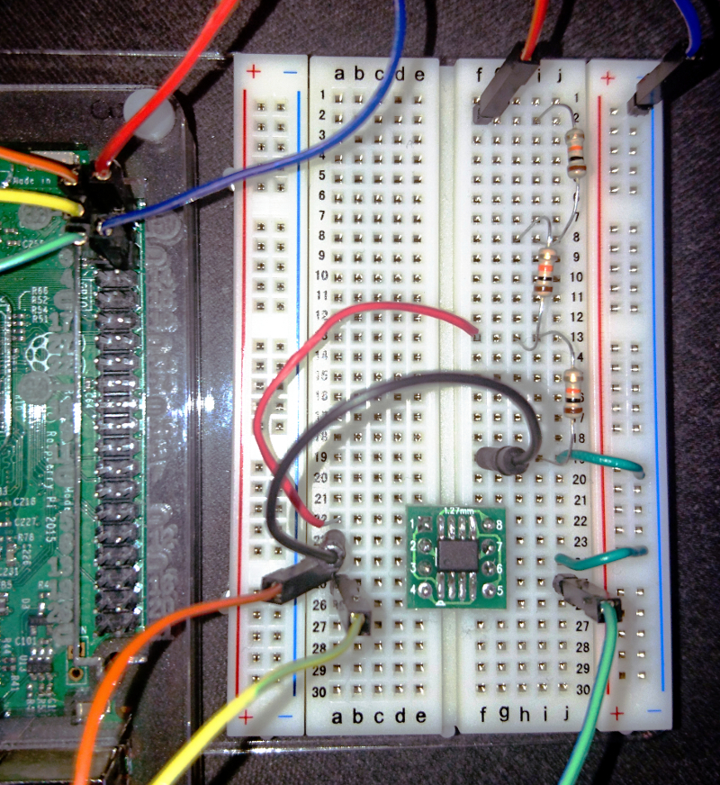

# MCP3426/sample

Bei dem Beispiel wird die Betriebsspannung des Raspberry Pi mit dem MCP3426 gemessen.

## Schaltung und Prototyp

Die 5-V-Betriebsspannung kann beim Raspberry Pi am Pin 2 (oder 4)
abgegriffen werden. Da der AD-Wandler maximal 2,048 V messen kann, ist
es erforderlich den Messbereich mithilfe eines Spannungsteilers
anzupassen. Im Beispiel wird die Spannung an eine Reihenschaltung aus
drei 10-kΩ-Widerständen angeschlossen. Der AD-Wandler misst allerdings
nur die Spannung an einem der Widerstände. Dadurch misst der
AD-Wandler nur ein Drittel der Betriebsspannung des Raspberry Pi.

U_max_neu = U_max_alt * (R_1 + R_2 + R_3) / R_3

U_max_neu = 2,048 V * (10 kΩ + 10 kΩ + 10 kΩ) / 10 kΩ = 2,048 V * 3 = 6,144 V

Mit der Schaltung wurde der Messbereich auf 6,144 V erweitert. Somit kann bei der Messung der USB-Spannung nichts passieren.

Beim Aufbau der Schaltung muss sorgfältig vorgegangen werden, da an den Eingängen des AD-Wandlers niemals eine größere Spannung als die Betriebsspannung (des AD-Wandlers, hier 3,3 V) anliegen sollte. Die GPIO-Pins des Raspberry Pi vertragen ebenfalls keine größere Spannung als 3,3 V.

## Beispielprogramm

Das [Beispielprogramm](mcp3426_sample.py) enthält eine Klasse für den MCP3426. Bisher kann nur der erste Kanals des AD-Wandlers verwendet werden.

Ein Video des Beispiels gibt es [hier](https://archive.org/details/mcp3426_sample).
