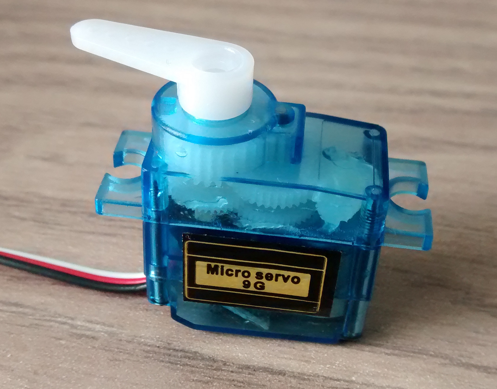
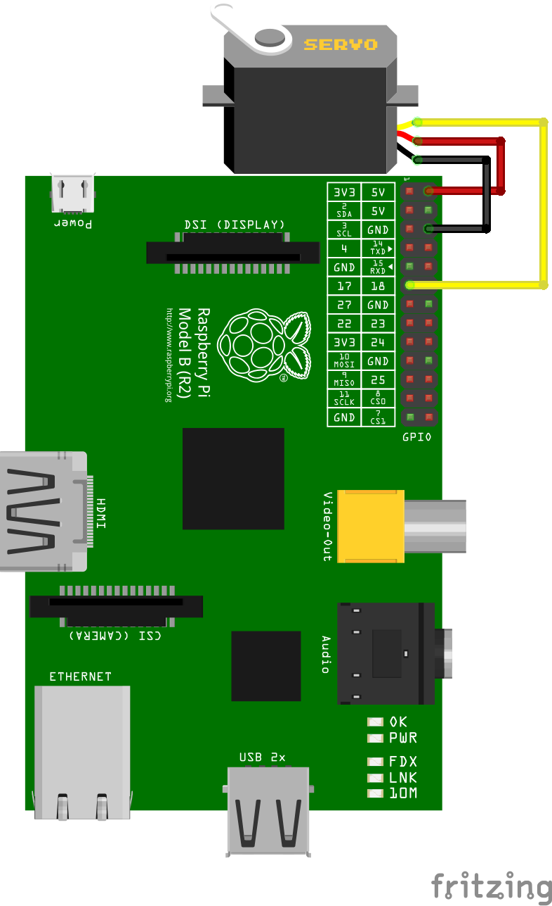

Servomotoren
============

Servomotoren sind Elektromotoren, die z.B. in Plottern,
Modellbauflugzeugen oder mechanischen Laufwerken verbaut werden.

Der Drehwinkel des Motors kann sehr genau eingestellt werden. Sie
lassen sich mittels PWM über die Länge des Impulses auf einem Pin
zudem sehr einfach ansteuern.

Das übersichtliche [Datenblatt](doc/SG90.pdf) des *Micro Servo 9G*
beschreibt weitere Details.

Schaltung
---------

Der Motor wird über den Pi mit Spannung versorgt. Zusätzlich wird ein
Kabel des Servos mit einem Hardware-PWM-Pin des Pi verbunden.

Quelltext
---------

Ein Beispielprogramm in der Datei [servo.py](servo.py) zeigt die
Verwendung.
