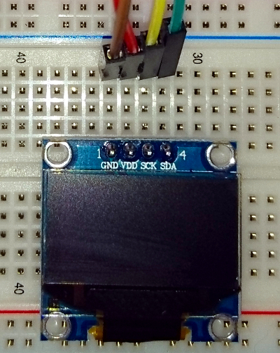

# OLED Display Treiber SSD1306 

Es gibt viele verschiedene OLED-Displays, die mit dem Treiber SSD1306
arbeiten. Der Treiber lässt sich entweder über eine parallele
Schnittstelle, SPI oder I²C steuern. Im Folgenden wird ein OLED-Modul
mit I²C-Schnittstelle vorgestellt.

## Datenblatt

- [Datenblatt](doc/ssd1306_datasheet.pdf)

## Schaltung

Das Display hat eine Größe von 0,96 Zoll (Bilddiagonale) und eine Auflösung von 128x64 Pixel. Vier Anschlusspins sind nach außen geführt:
* GND: Masse
* VDD: Betriebsspannung (3,3 V)
* SCK: Serial Clock (I²C)
* SDA: Serial Data (I²C)

## Adressierung

Je nach Beschaltung des SSD1306 kann die Slaveadresse entweder `0x3c` oder `0x3d` sein. Bei manchen Displays ist die Adresse auf der Rückseite durch die Position eines Widerstandes erkennbar.

## Kommunikation

Die Datenübertragung erfolgt mit einem Kontrollbyte gefolgt von einem
Datenbyte. Das Kontrollbyte entspricht der Registeradresse bei anderen
I²C-Bauteilen. Beim SSD1306 wird mit dem Kontrollbyte festgelegt, ob
ein Kommando oder Daten übertragen werden soll.

* Kontrollbyte für Kommandos: `0x00`
* Kontrollbyte für Daten: `0x40`

## Kommandos übertragen

Im Kapitel 9 des Datenblattes werden die Kommandos und damit die Konfigurationsmöglichkeiten beschrieben. Nach der Inbetriebnahme des Displays ist die Konfiguration erforderlich. Insbesondere das aktivieren der Ladungspumpe ist wichtig, diese ist im Datenblatt auf Seite 62 erklärt. 

Ein Flow Chart für die Initialisierung des Treibers ist im Datenblatt auf Seite 64 abgebildet.

## Daten übertragen

Der Graphic Display Data RAM (GDDRAM, Kapitel 8.7 im Datenblatt) ist in insgesamt 8 Pages unterteilt. Jede Page ist wiederum in 128 Segmente unterteilt. Jedes Segment enthält ein Datenbyte und repräsentiert 8 Pixel des Displays.

Zur Datenübertragung werden drei Adressierungsmodi (Datenblatt Kapitel 10.1.3) unterschieden. Je nach Modus wird der Address Pointer nach der Übetragung eines Datenbytes weitergesetzt. 

Bei der Standardkonfiguration (Page addressing mode) muss zunächst die Page adressiert werden, anschließend können die 128 Segmente beschrieben werden.

Beim Horizontal addressing mode springt der Address Pointer nach dem Beschreiben einer Page in die nächste. Dadurch können alle 8 Pages hintereinander beschrieben werden.

Der Vertical addressing mode funktioniert so ähnlich wie der horizontale, nur dass der Speicher Spaltenweise beschrieben wird.

 

## Quelltext

Der Quelltext der Datei [ssd1306.py](ssd1306.py) zeigt eine Klasse `OLED` in der die Initialisierung und Konfiguration des Displays realisiert wird. Anschließend werden Muster dargestellt. Die Klasse ist noch ausbaufähig.

Die Bibliothek 
[Adafruit_Python_SSD1306](https://github.com/adafruit/Adafruit_Python_SSD1306)
von Adafruit bietet einen leichteren Einstieg, wenn die Ansteuerung technisch
zu anspruchsvoll ist.

## Funktionsprüfung

